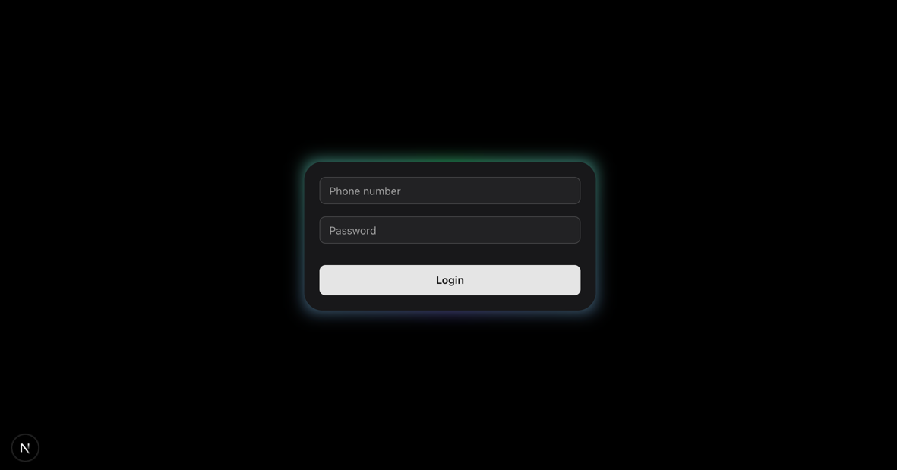

# Next Prisma MS SQL Demo

## 🚀 Overview

This is a demo project built with Next.js, Prisma, and MS SQL. It provides a simple login page and basic CRUD operations
with a Prisma-powered backend.



## ⚙️ Getting Started

1. **Install dependencies**:  
   Run `npm install` to install the necessary packages.

2. **Set up the database**:
    - Create your MS SQL database.
    - Update the `.env` file with the correct `DATABASE_URL`.

3. **Run Prisma migrations**:  
   Run `npm run db` to load the Prisma schema and models from `prisma/schema.prisma`.

4. **Seed the database**:  
   Run `npx prisma db seed` to seed the data from `prisma/seed.ts`.

5. **Run the application**:  
   Execute `npm run dev` to start the app.

## 🔧 Working with `createRequest`

The `createRequest` function is used to interact with the backend API for performing CRUD operations.

### Input Parameters:

- `_model`: The name of the model in the database (e.g., `user`).
- `_method`: The HTTP method for the operation (e.g., `GET`, `POST`, `PUT`, `DELETE`).
- `_where`: The filter conditions for querying records (for `GET`, `PUT`, `DELETE` operations).
- `_relation`: Any related data to include in the response.

### Output:

- Returns a response object containing:
    - `isSuccess`: A boolean indicating if the operation was successful.
    - `data`: The data returned from the database (could be a list or a single record, depending on the operation).

### Example:

- **Get users with a specific condition**:  
  **Input**:
  ```json
  {
    "_model": "user", "_method": "GET",
    "_where": { "phone": "0987654321", "password": "123456" },
    "_relation": ["roleRel"]
  }
  ```
  **Output**:
  ```json
  {
    "isSuccess": true,
    "data": 
        [{ 
           "id": 2008, "phone": "0987654321", "password": "123456", "roleId": 3,
           "roleRel": { "id": 3, "name": "director" } 
        }]
  }
  ```

- **Create user with phone password and role**:  
  **Input**:
  ```json
  {
    "_model": "user",
    "_method": "PUT",
    "phone": "EDITED",
    "_where": { "phone": "0987654321", "id": 2008 }
  }
  ```

- **Update user (id: 2008, phone: 0987654321) to change the phone number to 'EDITED'**:  
  **Input**:
  ```json
  {
    "_model": "user",
    "_method": "PUT",
    "phone": "EDITED",
    "_where": { "phone": "0987654321", "id": 2008 }
  }
  ```

## 📚 Notes:

- This project is a demo for basic CRUD operations using Prisma and MS SQL.
- Ensure you update the Prisma schema and rerun migrations when making changes to the models.
